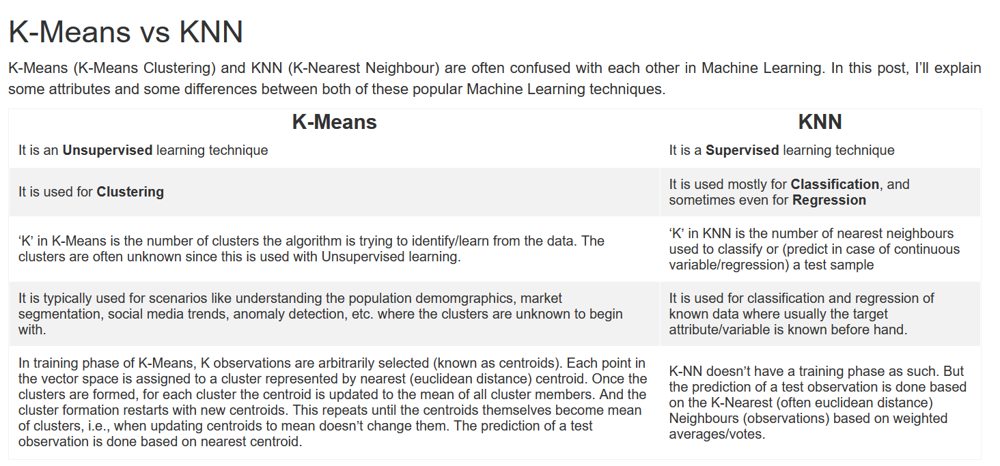
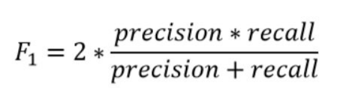
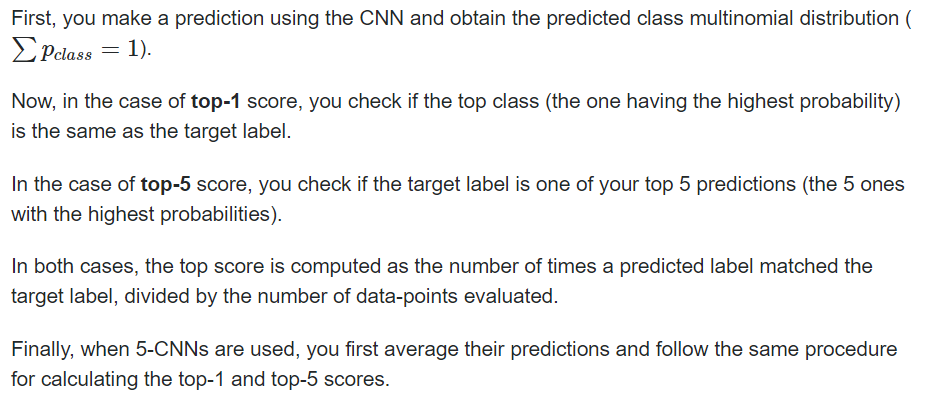
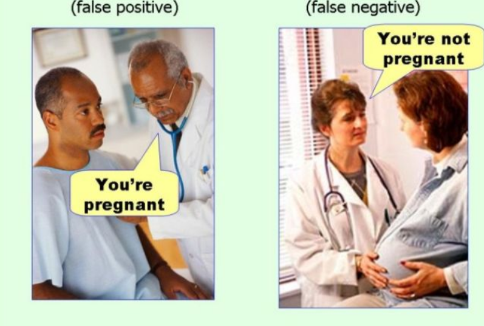

# Data Science Questions

The references to these are many from books, blogs, stackoverflow etc. This a work in progress and some of the answers may not be complete either. The answers are more like a high level intuitive information than the complete definition for many questions. 

## 1. The main difference between random forests and bagging - 

In Random Forest the best feature for a split is selected from a **random** subset of the available features.

In Bagging - all features are considered for the next split.

## 2. K-Means vs KNN (K-Nearest Neighbors)

| **K-means** | **KNN** |
| -- | -- |
| 1.  **K-means** clustering is an unsupervised machine learning | **KNN** is a supervised machine learning. It is supervised because you are trying to label a set of points based on a labeled set of other points. 
| 2. **K-means** is used for Clustering |  **KNN** is used mostly for Classification, and sometimes for Regression
| 3. **'K'** in **K-means** is the number of clusters that the algorithm is trying to identify from the data. The clusters are not known in advance |  **'K'** in **KNN** is the number of nearest neighbors used to classify or predict a test sample. It is a lazy learning algorithm. 'K' must be an odd number to avoid an equal number of votes !
| 4. **K-means** picks center of cluster at random first, runs iterations until centroids (mean of the clusters) stabilise | **KNN** - It measures which point belongs to which classification using a distance calculation.
| 5. Eg of usage - Using **K-means** one you can figure out who your customers are, what they have in common. | With **KNN** you can figure out what items customers purchase together.

Ref : 
- [K-Means vs KNN](http://abhijitannaldas.com/ml/kmeans-vs-knn-in-machine-learning.html)
- [Classification? Clustering? KNN vs K-Means](https://www.linkedin.com/pulse/classification-clustering-knn-vs-k-means-raymond-rashid)
- [What's the difference between -K-Means and KNN?](https://www.youtube.com/watch?v=OClrEI_5Ri4)

## 3. What is clustering ?

Clustering is simply a way to group samples of a dataset in such a way that objects in the same group are more similar to each other than objects in other groups. 

## 4. Parametrics vs Non-parametric models

A **parametric** model like linear regression has a predetermined number of parameters. Eg: Logistic Regression, Linear Regression and Linear SVC.

A **Non-parametric** model does not have a fixed set of parameters and in fact the number of parameters grow with the training data. Eg. Decision Tree / Random Forest, Kernel SVM and KNN.

## 5. What is regression ?

**Regression** is a statistical method that attempts to define / determine the strength of the relationship between a dependent (denoted by Y) variable and a single or multiple independent variables.

**Regression Analysis** is used to find equations that fit the data.

Regression is the process of finding the relationship between dependent variables and independent variables. The most
common form of regression is linear regression, so named because it assumes a linear relationship between variables.

## 6. What is linear regression ?

A **linear regression** is where the relationship between the dependent variable (Y) and independent variable (X) can be described with a line/trend.

If you plot line graph with with X and Y and a linear graph / trend emerges then this is **Linear regression** 

The equation has the form Y= a + bX, where Y is the dependent variable (that’s the variable that goes on the Y axis), X is the independent variable (i.e. it is plotted on the X axis), b is the slope of the line and a is the y-intercept.

Linear regression is very intuitive supervised learning technique algorithm and as its name suggests it is a *regression* technique. This maens it is used when we have continuous values such as car prices or temperature of a room.
Linear Regression seeks to find fits of data that are lines.

In linear regression we optimize an intercept and the slope. 

Check out [Top 10 ML Algorithms](https://www.educative.io/blog/top-10-ml-algorithms-for-data-science-in-5-minutes)

## 7. What is the difference between Supervised and Unsupervised ML ?

Supervised Algorithms use training data that have labelled data as output. Unsupervised data does not have labelled data. 

Supervised learning seeks to learn a function that maps the inputs (approximates a relationship ) to the labelled output -> f(x, y). 

All supervised learning algorithms have some set of weights that determine how the algorithm behaves
on different inputs, and determining the right weights is really at the core of
what we call *learning*.

Unsupervised learning tries to learn the underlying structure from the data.

## 8. Commonly used Supervised Leaning Algorithms

KNN classification, Random Forest, Decision Trees and Support Vector Machines. Neural Networks may also be used.

## 9. Difference between Classification and Regression

Classification outputs dicrete labels like [1, 2, 3]. Regression outputs continuous values like [1.012, -3.4221].

## 10. Two commonly used forms of cross-validation

Cross validation is a statistical technique which involves partiotioning the data into subsets, training the data on a subset and use other subset to evaluate the model performance. It can also be used to tune hyper parameters.

K-fold validation and Leave-One-Out-Validation are two most commonly used forms of cross-validation.

K-fold cross validation means splitting the data into k-folds and training the data on k-1 fold and using the kth fold for validating the model.

The model's performance is then aggregated as an average across all the k-fold runs.

Leave-One-Out-Validation is a special form of k-fold validation that is good for small datasets. Here the number of folds are equal to the number of data points in the input data set. In this only one training example is using for testing the model.

## 11. What is the commonly used error function in linear regression ?

Least squares is the most commonly used error function in linear regression. It is the square of the difference between the actual output labels and the predicted output labels obtained from the model.  

The least-squares cost is trying to minimize the sum of the squares of the residuals.

Note that F(X) is a function of the weights of our model.
In linear regression, F(X) would be a function of A1 and A0. The values of A1 and A0 that produce our optimal model are the values which achieve the minimal value of C(X).

## 12. Describe the k-nearest neighbors algorithm

In KNN - the label for a point is based on its distance from a predefined number of the nearest neighbors. The average of the distance may be taken (in regression) or majority (in classification) 

## 13. What is a key assumption in the Naive Bayes algorithm ?

Naives Bayes is frequently used for classification and it depends on the assumption that input features are indepedent of the output labels.

Naive Bayes is mostly used in spam filtering and recommendation systems.

## 14. How is a decision tree learned ?

Data is segmented based on a set of attributes and their values. A tree like structure is formed where each segmentation is made based on metrics like maximum information gain. Each split happens on a test value of the attribute and each branch represents a distinct value of the attribute.

## 15. In a K-Nearest Neighbors classifier, what effect does picking a smaller number of neighbors have for classification?

When a smaller set of points are used in KNN classifier these points have a disproportionate influence on the point to be classified making it more susceptible to these close neighbors. They may lead to *'jagged'* decision boundaries.

## 16. How do support vector machines work.

Support vectors look for a linear decision boundary which will separate the data, even if the data needs to be projected into a higher dimension where the data could be linearly separable.

## 17. Difference between L1 and L2 regularization.

L1 regularization considers the absolute value of the weights in contrast to L2 regularization which uses a squared magnitude.

L1 tends to push the weights down to exactly zero. This leads to sparse models, where all weights are zero except for the most important weights. This automatically  eliminates the weights of the least important features and therefore performs feature selection.

## 18. Explain the bias-variance tradeoff.

Bias in data science refers to the errors cause by wrong assumptions made about the data, such as assuming that the data is linear when it is actually quadratic.

Variance refers to the part of the error that is caused by excessive sensitivity to small variations in data.  This would mean the model cannot generalize well to new data.

## 19. You have a model suffering from low bias and high variance. What does this mean?

Low Bias and High Variance means the model is overfitting. To remedy this - one can add / increase regularization or  feed it more training data. 

If we have more features than data points - this can happen.

## 20. What can be done if the model is underfitting the data.

High Bias leads to underfitting and for this - some remedies are to reduce the regularization, increase model complexity or change the model itself. Or come up with better features.

## 21. Why is it not recommended to assess a model's quality using only its train error?

The model may draw incomplete and incorrect conclusions based on training error, and it may also learn the parameters of the training data very well and be unable to generalize to unseen data. 

## 22. What is PCA?

PCA - Principal component analysis is an algorithm that finds the axes along which maximum data variance is present. It projects the data on to a new subspace with fewer (or same) dimensions as the original data.

The axes are orthogonal to each other. It is commonly used as a pre-processing stage.

## 23. Some applications of PCA

PCA can be used for
- Compression
- Reduce memory / disk space required to store data
- Visualization

## 24. Some dimensionality reduction algorithms

- PCA
- Non negative matrix factorization
- Autoencoders

## 25. What is bagging ?

Bagging (or bootstrap aggregating) is an ensembling technique in which we create a number of bootstrapped datasets by sampling with replacement from a larger dataset. 

We then train the model on these smaller datasets and combine their outputs to form the larger model output

## 26. What is F1 score ?

F1 is a harmonic mean of the precision and recall of a model. 

F1 score sort of maintains a balance between the precision and recall for your classifier. If your precision is low, the F1 is low and if the recall is low again your F1 score is low.

Caveats
The main problem with the F1 score is that it gives equal weight to precision and recall. We might sometimes need to include domain knowledge in our evaluation where we want to have more recall or more precision.

F1 scores are good for imbalanced data sets. ( As is AUC ). These will account for class imbalance.

## 27. You are doing a classification task where you achieve 95% accuracy. Why should you be wary of these results?

Accuracy refers to the proportion of true results among the total number of cases examined.

Accuracy - (TP + TN)/ (TP + FP+ FN + TN)

> **When to use?** 
Accuracy is a valid choice of evaluation for classification problems which are well balanced and not skewed or No class imbalance.

> **Caveats** Suppose we were to predict if an asteroid will hit the earth. We just have to say 'No' all the time. In this case the accuracy would be ~99%. 

So while the model is accurate it does not mean it is valuable.

## 28. Imagine that you have a dataset with 10 features but some of the datapoints have several features missing. How could you handle this?

A few techniques to handle missing values

- Drop the data points with missing values ( not generally recommended since you may lose a lot of the data too )

- Reconstruct missing values - like taking mean / median / mode

-  Use a placeholder value like -1, NaN, -999 etc

## 29. What is dropout?

Dropout is a commonly used regularization technique that involves setting some of the weights in the layers of a network randomly to 0 during the forward pass of network computation. This has the effect of dropping them during training which helps prevent overfitting. 

Or at every training iteration a random subset of neurons in one or more layers (except the output layer) are dropped out. i.e. These neurons output 0 for the iteration.

Oversimplified - Dropouts work since they make a big neural network act like a bunch of little neural networks. And small neural networks do not overfit.

## 30. More on dropout.

A unique neural network is generated at each training step with a dropout. Since each neuron can be either present or absent, there are a total of 2N possible networks (where N is the total number of droppable neurons). 

This is such a huge number that it is virtually impossible for the same neural network to be sampled twice. Once you have run 10,000 training steps, you have essentially trained 10,000 different neural networks (each with just one training instance). 

These neural networks are obviously not independent because they share many of their weights, but they are nevertheless all different. The resulting neural network can be seen as an averaging ensemble of all these smaller neural networks

## 31. What is the difference between batch gradient descent and stochastic gradient descent?

Batch gradient descent computes the gradient on a collection of points (known as the batch which in the extreme case can be the entire train set) and then applies that update to the weights of a model.

Stochastic gradient descent only computes the gradient for a single point at a time and then immediately applies it to the weights of the model.

With Batch Gradient Descent it uses the whole training set to compute the gradients at every step, which makes it very slow when the training set is large.

In SGD since each gradient is calculated based on a single training example, the error surface is noisier than in gradient descent, which can also have the advantage that SGD can escape shallow local minima more readily if we are working with nonlinear cost functions.

In SGD randomness is good to escape from local optima, but bad because it means that the algorithm can never settle at the minimum.

Over time it will end up very close to the minimum, but once it gets there it will continue to bounce around, never settling down. 

So once the algorithm stops, the final parameter values are good, but not optimal.

## 32. What is transfer leaning ?

Transfer learning is the process of using a model previously trained on one dataset or task for a different dataset or task.
Transfer learning uses the previously learned weights of a trained model as a starting point for a new task.

It is commonly used to improve performance on smaller tasks by transferring weights from large datasets - like ImageNet for Computer Vision or WikiText for NLP.

While transfer learning often improves performance it may also introduce and additional source of unwanted bias. 

## 33. Precision, Recall and F1 Score

- Precision is the proportion of the True Positives among examples of predicted as positive.
- Recall is the proportion of True Positives among elements that had a positive label
- The F1 score is a harmonic mean of precision and recall

If you think of giving advice to a person, recall would be the ability to give advice in all potential relevant domains and some irrelevant ones (of which there are many), while precision would be giving advice in a few promising domains and ignoring the others. 

Precision answers the following question: what proportion of predicted Positives is truly Positive?

Recall answers a different question: what proportion of actual Positives is correctly classified?
Also called sensitivity or true positive rate this is the ratio of positive instances that are correctly detected by the classifier

## 34. Bias and Variance.

Weak performance on the training set is a symptom of high bias, also called underfitting, which means a model has failed to capture useful information: it is not even able to perform well on data points it has already been given the label for.

Strong performance on the training set but weak performance on the validation set is a symptom of high variance, also called overfitting, meaning that a model has found ways to learn the input/output mapping for the data it has been trained on, but what
it has learned does not generalize to unseen data.

## 35. Top 5 error rate

The top-5 error rate is the fraction of test images for which the correct label is not among the five labels considered most probable by the mode. 

Ref : [StackExchange](https://stats.stackexchange.com/questions/156471/imagenet-what-is-top-1-and-top-5-error-rate)

## 36. Confusion matrix

A confusion matrix allow us to compare a model's predictions with the true classes for each class.

A Confusion Matrix is a specific table layout that allows visualization of the performance of an algorithm, typically a supervised learning one.

It tells what your machine learning algorithm did right and ... what it did wrong.

## 37. Four common unsupervised learning tasks

- Clusetering - K-Means, DBSCAN
- Anomaly detection and novelty detection
- Visualization and Dimensionality reduction - PCA, t-SNE (Stochastic Neighbor embedding)
- Association rule learning - Apriori

## 38. Some clustering algorithms

- K-Means
- Agglomerative Clustering
- DBSCAN

## 39. Difference between Type 1 and Type2 Error

Type 1 is false positive. Claiming some outcome is positive when it is not. Type 2 error is false negative. Claiming some outcome is negative when it is actually not.

The below picture describes it perfectly.

## 40. What is the curse of dimensionality?

Curse of dimensionality refers to the fact that many problems that do not exist in the lower dimension arise in high dimensional space. In ML, randomly sampled high-dimensional vectors are generally very sparse, increasing the risk of overfitting and making it very difficult to identify patterns in the data without having plenty of training data

In theory, one solution to the curse of dimensionality could be to increase the size of the training set to reach a sufficient density of training instances. Unfortunately, in practice, the number of training instances required to reach a given density grows exponentially with the number of dimensions. 

## 41. What is LDA ?

LDA(Latent Dirichlet Allocation) is a probabalitic model that tries to find groups of words that appear frequently together across different documents. These frequently appearing words represent topics. Generally the number of topics is a hyperparameter that must be specified manually.

## 42. How to avoid overfitting ?

Overfitting can be avoided by

- Getting more data
- Use cross-validation techniques (like k-folds cross-validation)
- Use regularization techniques (like LASSO) that penalize model parameters likely to cause overfitting
- Keep the model simple (i.e. take in fewer variables) to reduce variance

## 43. Explain how to handle missing or corrupted data in a dataset

Three options
- Get rid of rows which contain the missing / corrupted data
- Get rid of the column (feature) which contains the missing / corrupted data
- Set the values to some value (zero, the mean, the median, the average)

## 44. Hyperparameter vs Model Parameter

### Hyperparameter

A hyperparameter is a variable that is external to the model. The value cannot be estimated from data, and they are commonly used to estimate model parameters. 

- A hyperparameter is a parameter of a learning algorithm (not of the model). 
- Its value cannot be estimated from the data
- They are most often set using heuristics 

Some examples of model hyperparameters include:
- The learning rate for training a neural network.
- The C and sigma hyperparameters for support vector machines.
- The k in k-nearest neighbors

### Model parameter

A model parameter is a configuration variable that is internal to the model and whose
value can be estimated from data.

- They are required by the model when making predictions.
- They values define the skill of the model on your problem.
- They are estimated or learned from data.
- They are often not set manually by the practitioner.

Some examples of model parameters include:

- The weights in an artificial neural network.
- The support vectors in a support vector machine.
- The coefficients in a linear regression or logistic regression

## 45. What is the purpose of a validation set?

A validation set is used to compare models. It makes it possible to select the best model and tune the hyperparameters.

## 46. You are working on a dataset. How do you select important variables? 

- Can use random forest to get feature importance and select the ones with most importance
- Can use Lasso which tends to completely eliminate the weights of the least important features (i.e., set them to zero). 

## 47. What is backpropogation ?

For each training instance in the data, backpropogation performs a prediction (forward pass), measures the error and then goes through each layer in reverse to measure the error contribution for each connection (reverse pass) and finally tweaks the connection weights to reduce error. (Gradient step)

## 48. What is a Derivative ?

We can have derivatives between two variables. Basically how one variable moves wrt change in another. If the derivative is positive, then when you change one variable, the other will move in the same direction. If the derivative is negative, then when you change one variable, the other will move in the opposite direction.

Given a function, the derivative represents the direction and the amount that one variable changes if you change the other variable.

You can compute the slope (derivative) of the line for any value of weight. You can then use this slope (derivative) to figure out which direction reduces the error. Even better, based on the steepness, you can get at least some idea of how far away you are from the optimal point where the slope is zero (although not an exact answer).

## 50. What is gradient descent ?

Learning is about error attribution or the art of figuring out how each weight played its part in creating error. 

Gradient descent results in computing a number for each weight. This number depicts how the weight should be higher or lower to reduce the error. It tells both the direction and amount you should change the weight value to reduce the error.

Gradient descent in a general learning algorithm that uses the derivative / slope to minimize some function iteratively.
In machine learning we use gradient descent to update the parameters of the model. The parameters refer to coefficients in Linear Regression and weights in neural networks.

Gradient descent is a very flexible learning algorithm. It can show you how to move the weights to reduce the
error. 

## 51. Different types of gradient descent ?

### 51-1. Full gradient descent
This type of gradient descent calculates the weight updates required over all the training data at each step. 

### 51-2. Stochastic gradient descent
Stochastic gradient descent updates weights one example at a time. 

### 51-3. Batch gradient descent
Batch gradient descent updates the weight after n examples. Instead of updating the weights after just one example or after the entire dataset of examples, you choose a batch size (typically between 8 and 256) of examples, after which the weights are updated.

## 52. What are Extra-trees ?

When you are growing a random forest, at each node only an random subset of features is considered for splitting. It is possible for to make trees even more random by also using random thresholds for each feature rather than searching for the best possible feature split like decision trees.

A forest of such extremely random trees is simply called an Extremely Randomized Trees ensemble (or Extra-Trees for short).

This trades more bias for lower variance. Extra trees are faster than regular random forest since finding the best possible threshold for each feature at each node is one of the most time-consuming tasks of growing a tree.

## 53. What is numpy ?
Numpy is a mathematics tool performs functions on matrices and multidimensional arrays.

## 54. What is the exploding gradients problem ?

Backpropogation algorithm works by going from the output to the input layer, propogating the error gradient along the way.

Once the algorithm computes the gradient descent of the cost function with regard to each parameter in the network, it uses these gradients to update each parameter a with gradient descent step.

Unfortunately gradients often get smaller and smaller as the algorithm progresses down to the lower layers. As a result, the Gradient Descent update leaves the lower layers’ connection weights virtually unchanged, and training never converges to a good solution. We call this the vanishing gradients problem.

In some cases, the opposite can happen: the gradients can grow bigger and bigger until layers get insanely large weight updates and the algorithm diverges. This is the exploding gradients problem, which surfaces in recurrent neural networks.

## 55. You are given a data set with missing values that spread along 1 standard deviation from the median. What percentage of data would remain unaffected?

The data is spread across median, so we can assume we're working with normal distribution. This means that approximately 68% of the data lies at 1 standard deviation from the mean. So, around 32% of the data unaffected. 

## 56. Why does XGBoost perform better than SVM? 

XGBoos is an **ensemble method** that uses many trees. This means it improves as it repeats itself.

SVM is a **linear separator**. So, if our data is not linearly separable, SVM requires a Kernel to get the data to a state where it can be separated. This can limit us, as there is not a perfect Kernel for every given dataset.

## 57. You build a random forest model with 10,000 trees. Training error as at 0.00, but validation error is 34.23. Explain what went wrong.

Your model is likely overfitted. A training error of 0.00 means that the classifier has mimicked training data patterns. This means that they aren't available for our unseen data, returning a higher error.

When using random forest, this will occur if we use a large amount of trees. 

## 58. Your dataset has 50 variables, but 8 variables have missing values higher than 30%. How do you address this? 

There are three general approaches you could take:

    - Just remove them (not ideal)
    - Assign a unique category to the missing values to see if there is a trend generating this issue
    - Check distribution with the target variable. If a pattern is found, keep the missing values, assign them to a new category, and remove the others.

## 59. Random Forest in simple words

Train a group of decision trees classifiers, each on a random subset of the training data. To make predictions you obtain the predictions of all the individual trees and vote for the class that gets the most votes.

Such an ensemble of decision trees is called Random Forest.

## 60. What is sampled softmax ?

Sampled softmax is used when training a classification model where are are many classes (thousands). It computes an approximation of the cross-entropy loss based on the logit predicted by the correct class and the predicted logits for a sample of the incorrect class. This speeds up training considerably as compared to computing softmax over all logits and then estimating cross entropy loss.

After training, the model can be used normally, using the regular softmax function to compute all the class probabilities based on all the logits.

## 61. Which cross validation technique would you choose for a time series dataset ?

A time series is not randomly distributed but has a chronological ordering. You can consider cross-validation on a rolling basis. Start with a small subset of data for training purpose, forecast for the later data points and then checking the accuracy for the forecasted data points.

## 63. ROC Curve 

The ROC curve plots the true positive rate against the false positive rate. 

AUC ROC - AUC is the area under the ROC curve.

AUC ROC indicates how well the probabilities from the positive classes are separated from the negative classes

## 64. Latent Dirichlet Allocation (LDA)

LDA is probabalistic model that tries to find groups of words that appear frequently together accross different documents.
The frequently appearing words represent topics. The input to an LDA is a bag-of-words model.

We need to define number of topics which is a hyperparameter of LDA.

## 65. Linear Discriminat Analysis (LDA)

Linear Discriminant Analysis (LDA) is actually a classification algorithm, but during training it learns the most discriminative axes between the classes, and these axes can then be used to define a hyperplane onto which to project the data.

The benefit is that the projection will keep classes as far apart as possible, so LDA is a good technique to reduce dimensionality before running another classification algorithm such as an SVM classifier.

## 66. PCA vs LDA

Principal component analysis (PCA) for unsupervised data compression

Linear discriminant analysis (LDA) as a supervised dimensionality reduction technique for maximizing class separability

## 67. PCA

PCA helps us to identify patterns in data based on the correlation between features. 

It aims to find the directions of maximum variance in high dimensional data and projects the data onto a new subspace with equal or fewer dimensions than the original one.

PCA directions are highly sensitive to data scaling, and we need to standardize the features prior to PCA if the features were measured on different scales and we want to assign equal importance to all features

**PCA is not linear regression**

- In linear regression, we are minimizing the squared error from every point to our predictor line. These are vertical distances.

- In PCA, we are minimizing the shortest distance, or shortest orthogonal distances, to our data points.

## 68. R squared

R squared is used as a measure of the goodness of fit. It is general quality of fit. i.e. how well the predicted values from regression match the actual values. R squared generally indicates lower values over more diverse and larger datasets, hence not good for deep learning.

## 69. Using pandas read a zip file

Pandas method `read_csv` can read a compressed ZIP file. We get it to do this by passing the name of the
ZIP file and the type of compression.

## 70. Backpropogation vs Gradient Descent

First, remember that the derivative of a function gives the direction in which the function increases, and its negative, the direction in which the function decreases.

Training a model is just minimising the loss function, and to minimise you want to move in the negative direction of the derivative. **Back-propagation is the process of calculating the derivatives and gradient descent is the process of descending through the gradient, i.e. adjusting the parameters of the model to go down through the loss function.**

Back-propagation is called like this because to calculate the derivative you use the chain rule from the last layer (which is the one directly connected to the loss function, as it is the one that provides the prediction) to the first layer, which is the one that takes the input data. You are "moving from back to front".

In gradient descent one is trying to reach the minimum of the loss function with respect to the parameters using the derivatives calculated in the back-propagation. The easiest way would be to adjust the parameters by substracting its corresponding derivative multiplied by a learning rate, which regulates how much you want to move in the gradient direction. But there are some more advanced algorithms like for example ADAM.

Ref :
https://datascience.stackexchange.com/questions/44703/how-does-gradient-descent-and-backpropagation-work-together

## 71. Gradient Descent

When you have two or more derivatives of the same function - they are called Gradient. When you use this gradient to descend to the lowest point in the loss function ( say sum of squared residuals ), it is called Gradient Descent.

Gradient Descent can be very sensitive to the learning rate.

Step 1 - Take the derivative of the **Loss function** for each parameter in it. ie. Take the **Gradient** of the **Loss function**.
Step 2 - Pick random values for the parameters
Step 3 - Plug the parameter values into the derivatives ( the **Gradient** )
Step 4 - Calculate the Step Sizes = **Step Size = Slope * Learning Rate**
Step 5 - Calculate the new parameters - **New Parameter = Old Parameter - Step Size**
Step 6 - Go back to **Step 3** and repeat until **Step Size** is very small or you reach **maximum number of steps.**

**Stochastic Gradient Descent** uses a randomly selected subset of the data at every step rather than the full dataset. This reduces the time spent in calculating the derivatives of the **Loss Function.**

[Statquest - Gradient Descent](https://www.youtube.com/watch?v=sDv4f4s2SB8)

## 72. Isolation Forest

Isolation Forest is a machine learning technique for identifying anomalies. It finds outliers by successive partitioning of the data until a data point has been isolated. Points that require fewer partitions to be isolate receive higher anomaly scores.

## 73. Regularization 

Regularization is a subset of methods used to encourage generalization in learned models often by increasing the difficulty for a model to learn the fine-grained details of training data.

Constraining a model to make it simpler and reduce the risk of overfitting.

Regularization aims to say that only weights with really strong correlation can stay on; everything else should be silenced because it’s contributing noise.

## 74. Reinforcement Learning

Reinforcement Learning is centered around the concept of learning by interaction. In RL the model learns from interactions with the environment to maximize a *reward* function.

With RL the model (also called an agent) interacts with the environment and by doing so generates a sequence of interactions that are together called an episode.

## 75. What is normalizing ?

We normalize a feature by subtracting the mean and then dividing by the standard deviation.The end result produces data within one standard deviation of the mean. We do this so that not a single feature overrides other features.

## 76. Filter in CNN

An important thing to realize is that a filter is nothing more than a matrix of numbers that is applied across an image in a step-wise fashion.

## 77. Cost function

Training and evaluating a machine learning model involves using something
called a **cost function**. In the case of supervised learning, a cost function is a
measure of how much the predicted labels outputted by our model deviate from
the true labels. Ideally we would like the deviation between the two to be small,
and so we want to minimize the value of our cost function.

The deviation between our predicted output (F(X)) and the true output ( Y )
is defined as a residual.

## 78. Analytical or Numerical Solution to achieve minimal values of cost

How do we actually compute the weights that achieve the minimal values of
our cost? Here, as with all machine learning models, we have two options: an
**analytical** or a **numerical solution**.

In an analytical solution we seek to find an exact closed form expression for the optimal value. It may involve standard calculus optimization. We would take gradients (fancy derivatives) of the cost function wrt the weights, set those gradients to 0, and then solve for the weights that achieve 0 gradient.

This technique is nice because once we have computed the closed-form expression
for the gradients, we can get the optimal weight values for any new data.

However, not all models have nice well-formed gradient expressions that allow
us to solve for the global optimum of a problem. For these problems, we must
turn to numerical methods.

**Numerical methods** typically involve a step-wise update procedure that iteratively brings weights closer to their optimal value.

Here we again compute the gradients with respect to all the weights and then
apply the following update for each weight A:

Anew = Aold − α · ∂C / ∂A

We continue applying these updates for some number of iterations until our
weight values converge, i.e they don’t change too much
from one iteration to the next. This very important numerical optimization
procedure is called gradient descent.

The alpha (α) value is being multiplied to the gradient. Alpha is an example of what is called in
machine learning a hyperparameter. The value of this hyperparameter alpha
determines how quickly updates are made to our weights. We are free to adjust
the value so that gradient descent converges more quickly.

## 79. Histograms

Histograms plot a continuous variable on the x-axis, in bins determined by the researcher, and the frequency of occurrence on the y axis.

Histograms provide a clear and meaningful illustration of the shape of a distribution, including central tendency, skewness (symmetry), excess kurtosis (relatively fat tails), and spread.

## 80. Underfitting

Underfitting occurs when your model is too simple to learn the underlying structure of the data.

The main options to overcome it - 

- Select a more powerful model, with more parameters.

- Feed better features to the learning algorithm (feature engineering).

- Reduce the constraints on the model (e.g., reduce the regularization hyperparameter).
